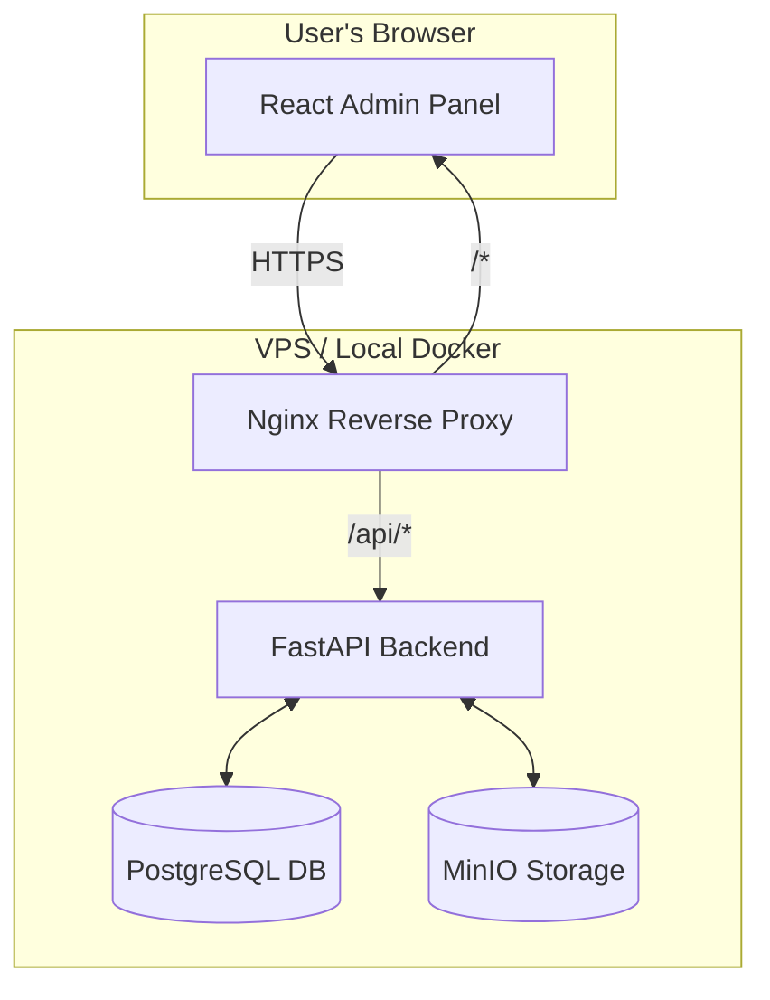

# Dream Central Storage Fullstack Architecture Document

## 1. Introduction

This document outlines the complete fullstack architecture for Dream Central Storage.

### Starter Template or Existing Project

The PRD specifies a greenfield project. To efficiently manage the monorepo container:

---

## 2. High Level Architecture

### Technical Summary

The Dream Central Storage system will be a **full-stack application** built within…

### Platform and Infrastructure Choice

The initial development environment will be run locally using Docker, perfectly mirroring production.

- **Platform:** Self-hosted on a **VPS** (e.g., DigitalOcean, Hetzner).
- **Key Services:**
  - **MinIO:** For S3-compatible object storage.
  - **PostgreSQL:** For relational metadata storage.
  - **Nginx:** As a reverse proxy to direct traffic to frontend and backend services.

### Repository Structure

We will use a **Monorepo** managed by **Turborepo** to contain all source code.

- **Structure:** Monorepo  
- **Monorepo Tool:** Turborepo  
- **Package Organization:**
  - `apps/`: Deployable applications (`api` for FastAPI backend, `admin` for React frontend).
  - `packages/`: Shared code such as common TypeScript types or UI components.

### High Level Architecture Diagram



---

### Architectural Patterns

- **Scalable Monolith:** Backend API as a single app with modular structure.  
  *Rationale: faster initial development, simpler deployment.*  

- **Component-Based UI:** React frontend as reusable components.  
  *Rationale: maintainable, scalable UI.*  

- **Repository Pattern (Backend):** Database logic abstracted via repository.  
  *Rationale: testability, flexibility.*  

- **API Gateway (via Reverse Proxy):** Nginx acts as API Gateway.  
  *Rationale: SSL termination, CORS, routing.*  

---

## 3. Tech Stack

| Category             | Technology       | Version | Purpose                           | Rationale |
|----------------------|------------------|---------|-----------------------------------|-----------|
| Frontend Language    | TypeScript       | 5.4+    | Adds static typing                | Improves code quality |
| Frontend Framework   | React            | 18.2+   | UI development                    | Large ecosystem |
| UI Component Library | MUI (Material-UI)| 5.15+   | Pre-built React components        | Faster UI dev |
| State Management     | Zustand          | 4.5+    | Global state mgmt                 | Simple, avoids Redux |
| Backend Language     | Python           | 3.11+   | Backend services                  | Flexible |
| Backend Framework    | FastAPI          | 0.111+  | High-performance APIs             | Modern, fast |
| API Style            | REST API         | N/A     | Client-server communication       | Well understood |
| Database             | PostgreSQL       | 16+     | Relational DB                     | Reliable |
| File Storage         | MinIO            | LATEST  | S3-compatible storage             | Self-hosted |
| Authentication       | JWT              | N/A     | Token-based auth                  | Stateless standard |
| Frontend Testing     | Vitest & RTL     | LATEST  | Unit/component tests              | Fast for React |
| Backend Testing      | Pytest           | 8.2+    | Testing FastAPI                   | Flexible |
| Build Tool           | Turborepo        | 2.0+    | Monorepo build system             | Optimizes builds |
| Bundler              | Vite             | 5.2+    | Frontend build/dev server         | Fast dev |
| Infrastructure       | Docker Compose   | LATEST  | Local orchestration               | Simplifies |
| CI/CD                | GitHub Actions   | N/A     | Automation, deployment            | Integrated |
| Monitoring           | Prometheus/Grafana| LATEST | Monitoring & visualization        | Specified in brief |

---

## 4. Data Models

### Book  
- **Purpose:** Represents metadata for a single interactive book.  

```ts
// packages/shared/
export interface Book {
  id: number;
  publisher: string;
  book_name: string;
  language: string;
  category: string;
  version?: string;
  status: 'draft' | 'published' | 'archived';
  created_at: string; // ISO 8601
  updated_at: string; // ISO 8601
}
```

### User  
- **Purpose:** Represents an admin user with credentials.  

```ts
// packages/shared/
export interface User {
  id: number;
  email: string;
  hashed_password: string;
}

export interface SafeUser {
  id: number;
  email: string;
}
```

---

## 5. API Specification

REST API with **OpenAPI 3.0** specification, including:  
- Auth  
- Book metadata CRUD  
- File uploads  

---

## 6. Components

System composed of:  
- React Admin Panel (Frontend)  
- FastAPI Backend  
- PostgreSQL DB  
- MinIO Storage  

```mermaid
graph TD
  A[React Admin Panel] -->|REST API (HTTPS)| B[FastAPI Backend]
  B -->|SQL Queries| C[(PostgreSQL)]
  B -->|S3 API| D[(MinIO Storage)]

  style A fill:#D6E8FF
  style B fill:#D5F5E3
  style C fill:#FFF4C1
  style D fill:#FFE4C4
```

---

## 7. External APIs
MVP is **self-contained**. No external API integrations.  

---

## 8. Core Workflows
Key workflows:  
- Admin Login  
- Book Folder Upload  
(Defined via sequence diagrams)  

---

## 9. Database Schema
PostgreSQL DDL for `users` and `books` tables, with constraints and triggers.  

---

## 10. Frontend Architecture
Patterns for:  
- Component Organization  
- State Management (Zustand)  
- Routing (React Router)  
- Services Layer  

---

## 11. Backend Architecture
Patterns for:  
- Service Architecture (FastAPI Routers)  
- Database (Repository Pattern)  
- Authentication (FastAPI Dependency)  

---

## 12. Unified Project Structure
Monorepo layout for:  
- `apps/`  
- `packages/`  
- `infrastructure/`  
- `docs/`  

---

## 13. Development Workflow
Includes:  
- Prerequisites  
- Setup commands  
- Dev scripts  
- Env variable configuration  

---

## 14. Deployment Architecture
Docker on VPS. Managed by **docker-compose.yml**. Automated with GitHub Actions CI/CD.  

---

## 15. Security and Performance
- Frontend security (XSS, CSP)  
- Backend security (rate limiting, CORS)  
- Performance optimization (caching, splitting)  

---

## 16. Testing Strategy
Testing Pyramid with:  
- Frontend (Vitest)  
- Backend (Pytest)  
- E2E  

---

## 17. Coding Standards
Minimal standards and naming conventions, enforced across project.  

---

## 18. Error Handling Strategy
Unified error handling: JSON format, global handlers.  

---

## 19. Monitoring and Observability
Prometheus + Grafana stack, observing backend & frontend health.  

---

## 20. Checklist Results Report

- **Overall Architecture Readiness:** High  
- **Project Type:** Full-Stack with UI  
- **Executive Summary:** Architecture is comprehensive, consistent, modern, AI-friendly.  
- **Critical Risks:** None identified. Scaling approach is sound.  
- **Final Decision:** Approved and ready for dev.  
