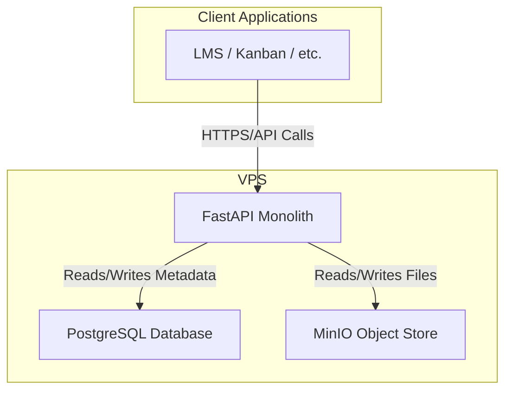
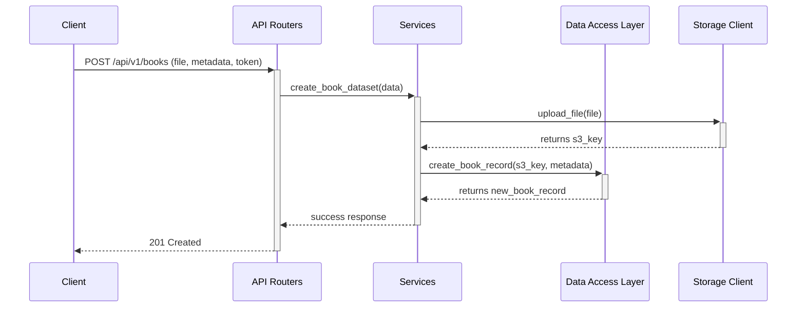
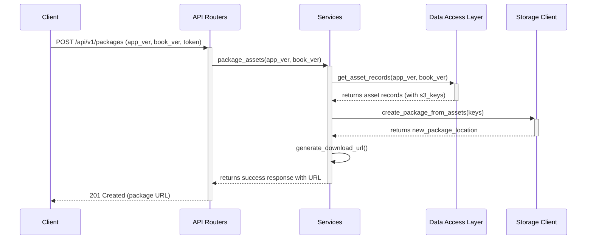

# Dream Central Storage Architecture Document

## Introduction
This document outlines the overall project architecture for Dream Central Storage, including backend systems, shared services, and non-UI specific concerns. Its primary goal is to serve as the guiding architectural blueprint for AI-driven development, ensuring consistency and adherence to chosen patterns and technologies.

### Starter Template or Existing Project
The project will be built using the official **Full Stack FastAPI PostgreSQL** starter template. This provides a production-ready, Dockerized foundation with a robust database layer and a scalable project structure.

### Change Log
| Date | Version | Description | Author |
| :--- | :--- | :--- | :--- |
| 2025-09-15 | 1.0 | Initial Architecture Draft | Winston |

---

## High Level Architecture

### Technical Summary
The architecture for Dream Central Storage is a **Dockerized monolithic API service** built with Python and FastAPI. It leverages the official FastAPI starter template for a production-grade foundation, including a PostgreSQL database with SQLAlchemy and Alembic for migrations. The service will be deployed to a VPS, where it will interact with a co-located MinIO S3-compatible object store to provide a secure, versioned, and intelligent API for managing the FlowBook ecosystem's digital assets.

### High Level Overview
* **Architectural Style**: Monolith. A single, cohesive FastAPI application will serve all API endpoints for the MVP. This simplifies development and deployment.
* **Repository Structure**: Polyrepo. This API service will live in its own dedicated repository, separate from any future web applications.
* **Data Flow**: Client applications will communicate with the API over HTTPS. The API will handle all business logic, authenticating requests before interacting with the PostgreSQL database for metadata and the MinIO object store for file assets.

### High Level Project Diagram

```mermaid
graph TD
    subgraph "Client Applications"
        A[LMS / Kanban / etc.]
    end

    subgraph "VPS"
        B[FastAPI Monolith]
        C[PostgreSQL Database]
        D[MinIO Object Store]
    end

    A -- "HTTPS/API Calls" --> B
    B -- "Reads/Writes Metadata" --> C
    B -- "Reads/Writes Files" --> D
```

### Architectural and Design Patterns
- **Repository Pattern**: We will use this pattern to abstract the data access logic from the business logic. The starter template facilitates this with SQLAlchemy, making our service more testable and independent of the database implementation.
- **Dependency Injection**: We will leverage FastAPI's native support for dependency injection to manage dependencies (like database sessions), which enhances modularity and testability.

---

## Tech Stack

### Cloud Infrastructure
- **Provider**: Self-hosted on a Virtual Private Server (VPS)
- **Key Services**: MinIO (S3-Compatible Object Store), PostgreSQL
- **Deployment Regions**: N/A (Single VPS instance initially)

### Technology Stack Table
| Category | Technology | Version | Purpose | Rationale |
| --- | --- | --- | --- | --- |
| Language | Python | 3.11.x | Primary development language | Modern, stable, and widely supported. |
| Framework | FastAPI | 0.103.x | Backend API framework | High performance, excellent async support, and native dependency injection. |
| Web Server | Uvicorn | 0.23.x | ASGI server for FastAPI | The standard, high-performance server for running FastAPI applications. |
| Database | PostgreSQL | 15.x | Primary relational database | Powerful, reliable, and works seamlessly with the chosen starter template. |
| Data Access (ORM) | SQLAlchemy | 2.0.x | Object-Relational Mapper | The de-facto ORM for Python, provides a robust way to interact with the DB. |
| DB Migrations | Alembic | 1.12.x | Database migration tool | Handles schema changes systematically. Included with the starter template. |
| Containerization | Docker | 24.0.x | Container runtime & tooling | Ensures a consistent environment for development and deployment. |
| File Storage | MinIO | Latest | S3-compatible object store | Provides the required S3 API for our assets, can be self-hosted on the VPS. |
| Testing | Pytest | 7.4.x | Testing framework | Standard for testing FastAPI applications; powerful and flexible. |

---

## Data Models

### 1. ApplicationBuild
**Purpose**: To track and manage each versioned build of the FlowBook desktop application.

**Key Attributes**:
- `id`: (UUID) Unique identifier for the database record.
- `version`: (Text) The semantic version of the application build (e.g., "2.1.0").
- `s3_key`: (Text) The path to the application's ZIP file in the MinIO store.
- `created_at`: (Timestamp) When the record was created.

### 2. BookDataset
**Purpose**: To track each versioned book dataset and its associated production metadata.

**Key Attributes**:
- `id`: (UUID) Unique identifier for the database record.
- `book_identifier`: (Text) A human-readable ID to group different versions of the same book (e.g., "algebra-101").
- `version`: (Text) The semantic version of the book dataset (e.g., "1.4.2").
- `s3_key`: (Text) The path to the book's data file in the MinIO store.
- `metadata`: (JSONB) A flexible field to store lifecycle data, such as creation date, edit history, and completion status.
- `created_at`: (Timestamp) When the record was created.

**Relationships**:  
For the MVP, these two models are independent. A relationship between an ApplicationBuild and a BookDataset is only formed temporarily when a user makes an API request to package them together.

---

## Components

### 1. API Routers
**Responsibility**: Defines the HTTP endpoints, handles request and response validation using Pydantic, and routes incoming requests to the appropriate service. This is the public-facing entry point of our application.

**Key Interfaces**:  
`POST /apps`, `POST /books`, `GET /apps`, `GET /books`, `GET /apps/{version}`, `POST /packages`, `GET /books/{...}/summary`

**Dependencies**: Services / Business Logic

### 2. Services / Business Logic
**Responsibility**: Contains the core application logic. For example, the PackagingService will orchestrate fetching files from storage and zipping them, while an AssetService will handle the creation and retrieval of asset records from the database.

**Key Interfaces**:  
Functions like `create_application_build()`, `get_all_books()`, `package_assets()`, `get_book_summary()`.

**Dependencies**: Data Access Layer, Storage Client

### 3. Data Access Layer (Repositories)
**Responsibility**: Implements the Repository Pattern for all database interactions. This component will contain classes like `ApplicationBuildRepository` that abstract away the SQLAlchemy queries, providing simple methods like `get_by_version()` or `create()`.

**Key Interfaces**: CRUD-like functions (Create, Read, Update, Delete) for each data model.

**Dependencies**: Database / SQLAlchemy ORM

### 4. Storage Client
**Responsibility**: A dedicated module that encapsulates all interaction with the MinIO S3-compatible object store. It will handle uploading, downloading, and managing file paths (S3 keys).

**Key Interfaces**: Functions like `upload_file()`, `generate_presigned_download_url()`, `get_file_stream()`.

**Dependencies**: MinIO S3 Server

---

## External APIs
Based on the requirements for the MVP, our service is entirely self-contained. It will interact with the database and the MinIO object store on the same server, but it does not need to consume any third-party or external APIs.

---

## Core Workflows

### 1. Uploading a New Asset (e.g., a Book Dataset)

```mermaid
sequenceDiagram
    participant Client
    participant API Routers
    participant Services
    participant DAL as Data Access Layer
    participant Storage Client
    
    Client->>+API Routers: POST /api/v1/books (file, metadata, token)
    API Routers->>+Services: create_book_dataset(data)
    Services->>+Storage Client: upload_file(file)
    Storage Client-->>-Services: returns s3_key
    Services->>+DAL: create_book_record(s3_key, metadata)
    DAL-->>-Services: returns new_book_record
    Services-->>-API Routers: success response
    API Routers-->>-Client: 201 Created
```

### 2. Packaging an App and a Book

```mermaid
sequenceDiagram
    participant Client
    participant API Routers
    participant Services
    participant DAL as Data Access Layer
    participant Storage Client

    Client->>+API Routers: POST /api/v1/packages (app_ver, book_ver, token)
    API Routers->>+Services: package_assets(app_ver, book_ver)
    Services->>+DAL: get_asset_records(app_ver, book_ver)
    DAL-->>-Services: returns asset records (with s3_keys)
    Services->>+Storage Client: create_package_from_assets(keys)
    Storage Client-->>-Services: returns new_package_location
    Services->>Services: generate_download_url()
    Services-->>-API Routers: returns success response with URL
    API Routers-->>-Client: 201 Created (package URL)
```

---

## Database Schema
```sql
-- Enable UUID generation function if not already enabled
CREATE EXTENSION IF NOT EXISTS "pgcrypto";

-- Table for storing application builds
CREATE TABLE application_builds (
    id UUID PRIMARY KEY DEFAULT gen_random_uuid(),
    version TEXT NOT NULL,
    s3_key TEXT NOT NULL,
    created_at TIMESTAMP WITH TIME ZONE DEFAULT NOW(),

    -- Ensure every version string is unique
    UNIQUE(version)
);

-- Table for storing book datasets and their metadata
CREATE TABLE book_datasets (
    id UUID PRIMARY KEY DEFAULT gen_random_uuid(),
    book_identifier TEXT NOT NULL,
    version TEXT NOT NULL,
    s3_key TEXT NOT NULL,
    metadata JSONB,
    created_at TIMESTAMP WITH TIME ZONE DEFAULT NOW(),

    -- Ensure that for any given book, the version is unique
    UNIQUE(book_identifier, version)
);

-- Add an index for faster lookups of all versions of a specific book
CREATE INDEX idx_book_datasets_identifier ON book_datasets(book_identifier);
```

---

## Source Tree
```plaintext
dream-central-storage-api/
├── alembic/                   # Database migration scripts (Alembic)
├── app/
│   ├── api/                   # API Endpoints (Routers)
│   │   └── v1/
│   │       ├── endpoints/
│   │       │   ├── assets.py      # Routers for /apps and /books
│   │       │   └── packages.py    # Router for /packages
│   │       └── deps.py          # FastAPI dependencies (e.g., for auth)
│   ├── core/                  # Core application settings (e.g., config)
│   ├── crud/                  # Data Access Layer (Repositories)
│   │   ├── crud_app_build.py
│   │   └── crud_book_dataset.py
│   ├── db/                    # Database session management
│   ├── models/                # SQLAlchemy Data Models
│   │   ├── application_build.py
│   │   └── book_dataset.py
│   ├── schemas/               # Pydantic schemas (for API validation)
│   ├── services/              # Business Logic
│   │   ├── packaging_service.py # Logic for zipping files
│   │   └── storage_service.py   # Logic for interacting with MinIO
│   ├── tests/                 # All application tests
│   └── main.py                # Main FastAPI application entrypoint
├── docker-compose.yml         # Docker configuration
├── Dockerfile                 # Application Dockerfile
└── requirements.txt           # Python package dependencies
```

---

## Infrastructure and Deployment

### Infrastructure as Code
- **Tool**: Docker Compose
- **Location**: `docker-compose.yml` in the root of the project.
- **Approach**: We will use a single docker-compose.yml file to define all the services required to run our application: the FastAPI API, the PostgreSQL database, and the MinIO object store.

### Deployment Strategy
**Strategy**: Git Pull & Rebuild

**Process**:
1. SSH into the production VPS.
2. Navigate to the project directory.
3. Pull the latest changes from the main branch of the Git repository.
4. Run `docker-compose up --build -d` to rebuild the API container and restart services.

### Environments
- **Development**: Runs on a developer's local machine using `docker-compose up`.
- **Production**: A single VPS instance.

### Rollback Strategy
**Primary Method**: Git Revert. On the VPS, check out the previous stable Git commit/tag and re-run the `docker-compose up --build -d` command.

---

## Error Handling Strategy

### General Approach
- **Error Model**: Use custom exception classes for business logic errors, caught by centralized FastAPI exception handlers to produce consistent JSON error responses.
- **Error Propagation**: All user-facing errors will be returned as a JSON object with an appropriate HTTP status code.

### Logging Standards
- **Library**: Python's standard logging module.
- **Format**: Structured JSON format written to stdout for container log collection.

### Error Handling Patterns
- **Business Logic Errors**: Custom exception classes will be caught by a global handler to return clean error responses.
- **Data Consistency**: Database operations will be wrapped in transactions via SQLAlchemy sessions to ensure atomicity.

---

## Coding Standards

### Core Standards
- **Language**: Python 3.11.x
- **Style & Linting**: We will use Black for code formatting and Ruff for linting.
- **Test Organization**: Tests will reside in `app/tests/`, with filenames following `test_*.py`.
- **Naming Conventions**: Adherence to the standard Python PEP 8 style guide.

### Critical Rules
- Use the Data Access Layer: All database operations MUST go through functions in `app/crud/`.
- Type Hint Everything: All function signatures and variables MUST include Python type hints.
- Use Pydantic for API Schemas: All API request/response bodies MUST be defined using Pydantic models in `app/schemas/`.
- Centralized Configuration: Settings MUST be accessed through the config object from `app/core/config.py`.

---

## Test Strategy and Standards

### Testing Philosophy
- **Approach**: Test-After development for the MVP.
- **Coverage Goals**: Aim for a minimum of 80% code coverage.
- **Test Pyramid**: A strong base of Unit Tests, with a focused set of Integration Tests.

### Test Types and Organization
- **Unit Tests**: Use Pytest and unittest.mock. Located in `app/tests/unit/`.
- **Integration Tests**: Use Pytest and Testcontainers to spin up a temporary PostgreSQL container for realistic testing. Located in `app/tests/integration/`.

### Test Data Management
- **Strategy**: Use Pytest fixtures to create and manage test data.

---

## Security

### Input Validation
- **Required Rules**: All incoming request data MUST be validated using FastAPI's Pydantic integration.

### Authentication & Authorization
- **Auth Method**: Token-based authentication (Bearer Tokens).
- **Token Generation Flow**: A public endpoint (e.g., `POST /api/v1/login/token`) will validate client credentials and issue a short-lived, signed JWT.
- **Required Patterns**: Sensitive endpoints MUST enforce authentication using FastAPI's Depends system.

### Secrets Management
- **Code Requirements**: Secrets MUST NOT be hardcoded. They must be loaded from environment variables via the central configuration module.

### API Security
- **Rate Limiting**: A rate limiter will be implemented to prevent abuse.
- **HTTPS Enforcement**: Production deployment MUST enforce HTTPS.

### Dependency Security
- **Scanning Tool**: Use GitHub's Dependabot or pip-audit to scan dependencies for vulnerabilities.
