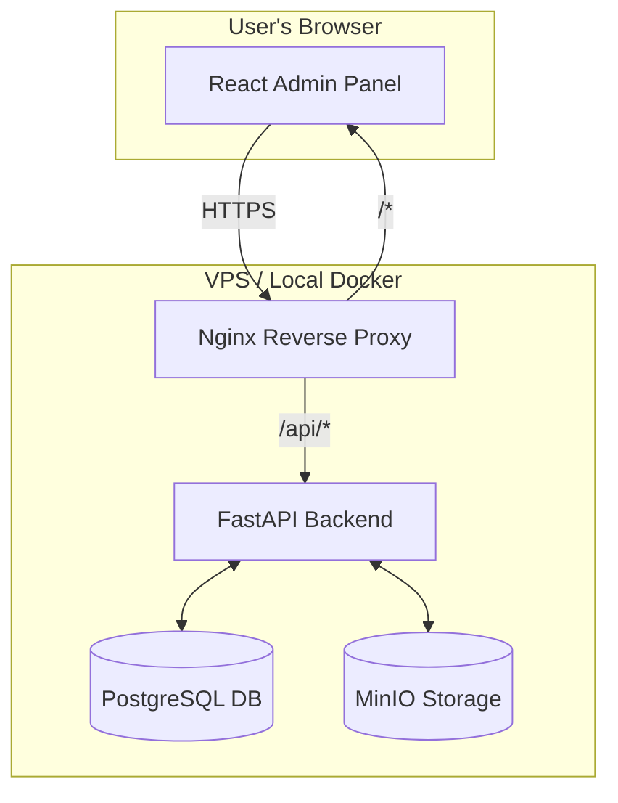

# 2. High Level Architecture

## Technical Summary

The Dream Central Storage system will be a **full-stack application** built within…

## Platform and Infrastructure Choice

The initial development environment will be run locally using Docker, perfectly mirroring production.

- **Platform:** Self-hosted on a **VPS** (e.g., DigitalOcean, Hetzner).
- **Key Services:**
  - **MinIO:** For S3-compatible object storage.
  - **PostgreSQL:** For relational metadata storage.
  - **Nginx:** As a reverse proxy to direct traffic to frontend and backend services.

## Repository Structure

We will use a **Monorepo** managed by **Turborepo** to contain all source code.

- **Structure:** Monorepo  
- **Monorepo Tool:** Turborepo  
- **Package Organization:**
  - `apps/`: Deployable applications (`api` for FastAPI backend, `admin` for React frontend).
  - `packages/`: Shared code such as common TypeScript types or UI components.

## High Level Architecture Diagram

---

## Architectural Patterns

- **Scalable Monolith:** Backend API as a single app with modular structure.  
  *Rationale: faster initial development, simpler deployment.*  

- **Component-Based UI:** React frontend as reusable components.  
  *Rationale: maintainable, scalable UI.*  

- **Repository Pattern (Backend):** Database logic abstracted via repository.  
  *Rationale: testability, flexibility.*  

- **API Gateway (via Reverse Proxy):** Nginx acts as API Gateway.  
  *Rationale: SSL termination, CORS, routing.*  

---
