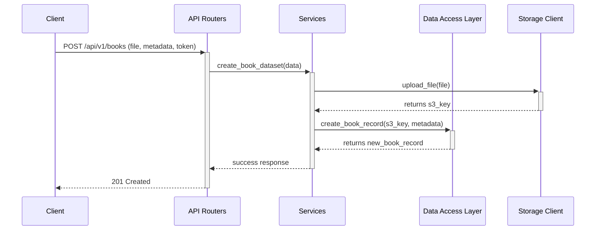
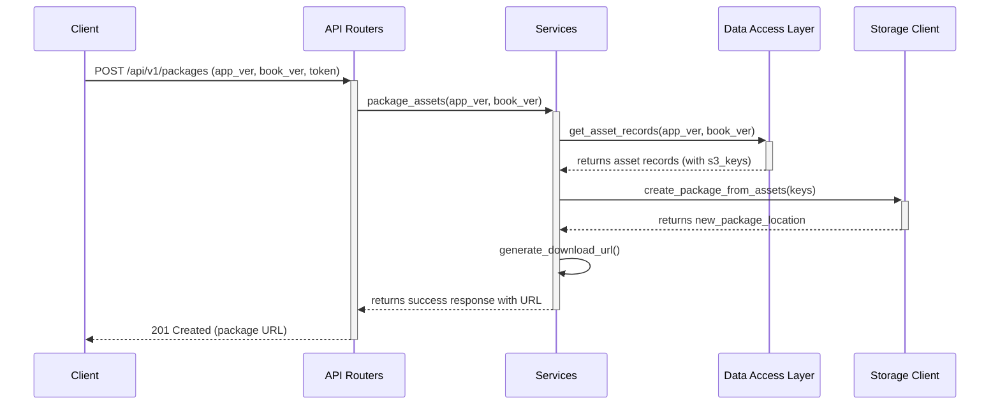

# Core Workflows

## 1. Uploading a New Asset (e.g., a Book Dataset)

```mermaid
sequenceDiagram
    participant Client
    participant API Routers
    participant Services
    participant DAL as Data Access Layer
    participant Storage Client
    
    Client->>+API Routers: POST /api/v1/books (file, metadata, token)
    API Routers->>+Services: create_book_dataset(data)
    Services->>+Storage Client: upload_file(file)
    Storage Client-->>-Services: returns s3_key
    Services->>+DAL: create_book_record(s3_key, metadata)
    DAL-->>-Services: returns new_book_record
    Services-->>-API Routers: success response
    API Routers-->>-Client: 201 Created
```

## 2. Packaging an App and a Book

```mermaid
sequenceDiagram
    participant Client
    participant API Routers
    participant Services
    participant DAL as Data Access Layer
    participant Storage Client

    Client->>+API Routers: POST /api/v1/packages (app_ver, book_ver, token)
    API Routers->>+Services: package_assets(app_ver, book_ver)
    Services->>+DAL: get_asset_records(app_ver, book_ver)
    DAL-->>-Services: returns asset records (with s3_keys)
    Services->>+Storage Client: create_package_from_assets(keys)
    Storage Client-->>-Services: returns new_package_location
    Services->>Services: generate_download_url()
    Services-->>-API Routers: returns success response with URL
    API Routers-->>-Client: 201 Created (package URL)
```

---
