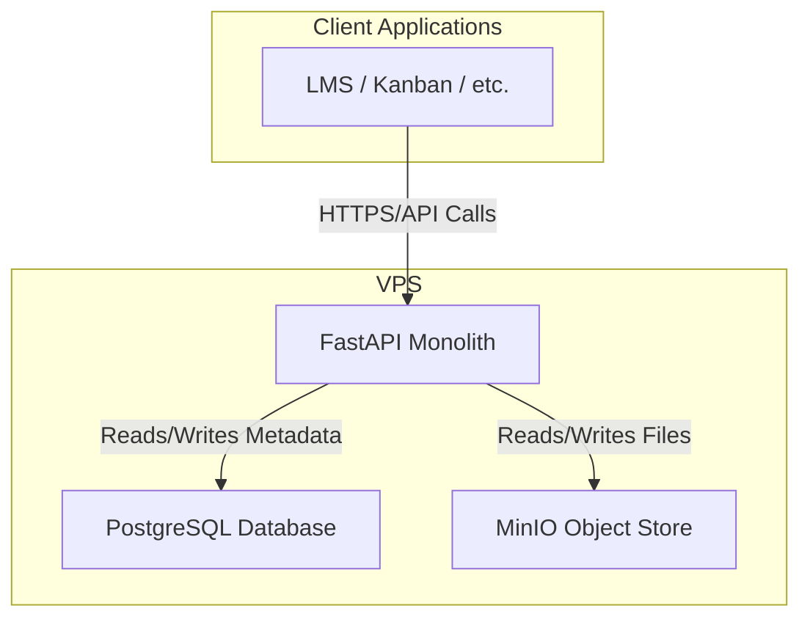

# High Level Architecture

## Technical Summary
The architecture for Dream Central Storage is a **Dockerized monolithic API service** built with Python and FastAPI. It leverages the official FastAPI starter template for a production-grade foundation, including a PostgreSQL database with SQLAlchemy and Alembic for migrations. The service will be deployed to a VPS, where it will interact with a co-located MinIO S3-compatible object store to provide a secure, versioned, and intelligent API for managing the FlowBook ecosystem's digital assets.

## High Level Overview
* **Architectural Style**: Monolith. A single, cohesive FastAPI application will serve all API endpoints for the MVP. This simplifies development and deployment.
* **Repository Structure**: Polyrepo. This API service will live in its own dedicated repository, separate from any future web applications.
* **Data Flow**: Client applications will communicate with the API over HTTPS. The API will handle all business logic, authenticating requests before interacting with the PostgreSQL database for metadata and the MinIO object store for file assets.

## High Level Project Diagram

## Architectural and Design Patterns
- **Repository Pattern**: We will use this pattern to abstract the data access logic from the business logic. The starter template facilitates this with SQLAlchemy, making our service more testable and independent of the database implementation.
- **Dependency Injection**: We will leverage FastAPI's native support for dependency injection to manage dependencies (like database sessions), which enhances modularity and testability.

---
